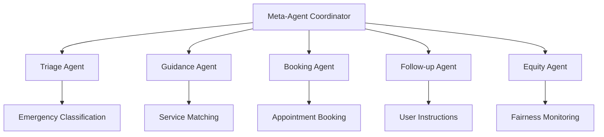

# Frontline Worker Support AI

**An AI-Powered Emergency Response Coordination System for Pakistani Emergency Services**


## 🌟 Overview

Frontline Worker Support AI is an intelligent emergency response coordination system that leverages a multi-agent AI architecture to provide rapid, accurate, and equitable emergency service matching for Pakistani communities. The system processes natural language emergency requests and coordinates with appropriate services through sophisticated AI-powered triage, guidance, and follow-up mechanisms.

## 🏗️ Architecture

### Multi-Agent System Design

The application employs a sophisticated **Meta-Agent Coordinator** that orchestrates five specialized AI agents:



#### 🤖 Agent Responsibilities

| Agent | Purpose | AI Integration |
|-------|---------|----------------|
| **Meta-Agent Coordinator** | Orchestrates all agents, handles conflict resolution, system health monitoring | Google Gemini 1.5 Pro |
| **Triage Agent** | Analyzes urgency levels (High/Medium/Low) based on medical and situational context | Google Gemini 1.5 Pro |
| **Guidance Agent** | Matches requests to appropriate services (hospitals, police, fire, emergency, mental health) | Google Gemini 1.5 Pro |
| **Booking Agent** | Creates confirmed bookings with Pakistani emergency services | Rule-based with AI oversight |
| **Follow-up Agent** | Generates personalized instructions and action items | Google Gemini 1.5 Pro |
| **Equity Agent** | Monitors service fairness and accessibility across demographics | Google Gemini 1.5 Pro |

## 🚀 Key Features

### 🧠 **Real-Time AI Processing**
- **Google Gemini 1.5 Pro Integration**: All agents powered by state-of-the-art language models
- **Intelligent Triage**: Contextual urgency classification with medical and situational awareness
- **Smart Service Matching**: AI-driven service selection considering location, urgency, and availability
- **Personalized Follow-up**: Culturally-aware communication for Pakistani contexts

### 🛡️ **Robust Fallback Systems**
- **Degraded Mode Operation**: Continues functioning with rule-based logic when AI services are unavailable
- **Meta-Agent Conflict Resolution**: Automatically resolves conflicts between agent recommendations
- **System Health Monitoring**: Real-time assessment of service availability and performance

### 🎯 **Emergency Service Coverage**
- **Hospitals**: PIMS, Shifa International, Combined Military Hospital (CMH)
- **Emergency Services**: Rescue 1122, Edhi Ambulance Service
- **Police Services**: Islamabad Police Emergency, Rawalpindi Police
- **Fire Department**: Capital Development Authority Fire Service
- **Mental Health**: Institute of Psychiatry & Behavioral Sciences

### 📊 **Equity & Fairness Monitoring**
- **Bias Detection**: AI-powered analysis of service distribution patterns
- **Response Time Tracking**: Monitoring for equitable access across different demographics
- **Fairness Scoring**: Quantitative assessment of service equity (0-1 scale)

## 🛠️ Technical Stack

### **Frontend Architecture**
- **React 18.3.1** with **TypeScript 5.5.3** for type-safe development
- **Vite 5.4.2** for lightning-fast development and optimized builds
- **Tailwind CSS 3.4.1** for responsive, utility-first styling
- **Lucide React** for consistent iconography

### **AI & Backend Services**
- **Google Generative AI SDK 0.24.1** for Gemini 1.5 Pro integration
- **Real-time Processing**: Streaming AI responses with fallback mechanisms
- **Error Handling**: Comprehensive error boundaries and recovery systems

### **Development Tools**
- **ESLint 9.9.1** with TypeScript integration for code quality
- **PostCSS** with Autoprefixer for CSS optimization
- **Strict TypeScript Configuration** for enhanced type safety

## 📋 Prerequisites

- **Node.js** 18.0.0 or higher
- **npm** 9.0.0 or higher
- **Google Gemini API Key** (required for AI functionality)

## 🚀 Installation & Setup

### 1. Clone the Repository
```bash
git clone https://github.com/Muhammad-Saif-Ur-Rehman/frontline-worker-support-ai.git
cd frontline-worker-support-ai
```

### 2. Install Dependencies
```bash
npm install
```

### 3. Environment Configuration
Create a `.env` file in the project root:
```env
VITE_GEMINI_KEY=your_google_gemini_api_key_here
```

**To obtain a Gemini API Key:**
1. Visit [Google AI Studio](https://aistudio.google.com/)
2. Create an account or sign in
3. Generate an API key from the dashboard
4. Replace `your_google_gemini_api_key_here` with your actual key

### 4. Start Development Server
```bash
npm run dev
```

The application will be available at `http://localhost:5173`

## 📖 Usage Guide

### **Basic Operation**

1. **Submit Emergency Request**: Enter a natural language description of your emergency
2. **Real-time Processing**: Watch as 5 AI agents coordinate to process your request
3. **Service Matching**: Receive matched emergency services with contact information
4. **Booking Confirmation**: Get confirmed appointment/dispatch with booking ID
5. **Follow-up Instructions**: Receive personalized next steps and emergency contacts

### **Example Scenarios**

```typescript
// Critical Emergency
"My father has collapsed in Islamabad and is unconscious. Please help immediately!"

// Traffic Accident
"There was a car accident near PIMS hospital. Two people are injured."

// Crime Report
"I witnessed a robbery at F-6 market in Islamabad. Need police assistance."

// Mental Health Crisis
"I'm having severe anxiety and need mental health support in Rawalpindi."
```

### **Testing Conflict Resolution**
```javascript
// Use browser console to test meta-agent coordination
window.testCoordinator.processRequest({
  id: 'test-123',
  text: 'Emergency request text here',
  timestamp: new Date(),
  location: 'Islamabad'
}, 'conflict'); // Forces conflict resolution mode
```

## 🧪 Development Scripts

```bash
# Development server with hot reload
npm run dev

# Type checking
npm run typecheck

# ESLint code analysis
npm run lint

# Production build
npm run build

# Preview production build
npm run preview
```

## 🏥 Service Integration

### **Pakistani Emergency Services Database**

The system includes comprehensive data for major emergency services:

- **Geographic Coverage**: Islamabad and Rawalpindi metropolitan areas
- **Service Types**: Medical, emergency, police, fire, mental health
- **Real Contact Information**: Verified phone numbers and addresses
- **Availability Tracking**: Real-time service status monitoring

### **AI-Powered Service Matching Logic**

```typescript
// Service matching criteria
- Car accidents/Vehicle crashes → Emergency services (Rescue 1122)
- Crime/Safety/Robbery/Theft → Police services
- Medical emergencies → Hospitals with trauma capabilities
- Fire/Explosions → Fire department
- Mental health crises → Specialized mental health services
```

## 🔧 System Architecture Details

### **Meta-Agent Coordination Process**

1. **Request Ingestion**: Natural language processing and context extraction
2. **System Health Check**: Assessing AI service availability and system status
3. **Processing Mode Determination**: Normal vs. degraded operation mode selection
4. **Sequential Agent Execution**: Coordinated 5-step processing pipeline
5. **Conflict Resolution**: Meta-agent arbitration of conflicting recommendations
6. **Result Compilation**: Comprehensive response with full processing trace

### **Error Handling & Resilience**

- **AI Service Failures**: Automatic fallback to rule-based processing
- **Network Issues**: Offline-capable degraded mode operation
- **Invalid Responses**: JSON parsing error recovery with sensible defaults
- **Rate Limiting**: Graceful handling of API quota limitations

## 🎯 Performance Optimizations

- **Streaming AI Responses**: Real-time processing feedback
- **Optimized Bundle Size**: Vite-powered development and build optimization
- **Lazy Loading**: Component-level code splitting for faster initial loads
- **Caching Strategy**: Efficient API response caching and revalidation

## 🔒 Security & Privacy

- **API Key Protection**: Environment variable isolation for sensitive credentials
- **Privacy-First Design**: Minimal demographic data collection with user consent
- **Secure Communications**: HTTPS-only API communications
- **Data Anonymization**: Personal information stripped from logging and analytics

## 📱 Browser Compatibility

- **Chrome 90+**: Full feature support
- **Firefox 88+**: Complete functionality
- **Safari 14+**: Full compatibility
- **Edge 90+**: All features supported

## 🤝 Contributing

We welcome contributions to improve the emergency response system:

1. **Fork the repository**
2. **Create a feature branch**: `git checkout -b feature/amazing-feature`
3. **Commit your changes**: `git commit -m 'Add amazing feature'`
4. **Push to the branch**: `git push origin feature/amazing-feature`
5. **Open a Pull Request**

### **Development Guidelines**

- Follow TypeScript best practices and maintain type safety
- Write comprehensive tests for new AI agent functionality
- Ensure accessibility compliance (WCAG 2.1 AA)
- Test with multiple emergency scenarios and edge cases
- Document new features and API changes

## 🐛 Troubleshooting

### **Common Issues**

**AI Services Not Working**
```bash
# Check API key configuration
echo $VITE_GEMINI_KEY

# Verify network connectivity
curl -I https://generativelanguage.googleapis.com

# Check console for detailed error messages
```

**Build/Development Issues**
```bash
# Clear node modules and reinstall
rm -rf node_modules package-lock.json
npm install

# TypeScript compilation issues
npm run typecheck

# Clear Vite cache
rm -rf node_modules/.vite
```

**Service Matching Problems**
- Check console logs for meta-agent coordination details
- Verify that service keywords match your request language
- Test with different urgency levels and service types

## 📄 License

This project is licensed under the MIT License - see the [LICENSE](LICENSE) file for details.

## 👥 Authors & Acknowledgments

- **Muhammad Saif Ur Rehman** - *Lead Developer & AI Architecture*
- **Powered by Google Gemini 1.5 Pro** - *Advanced AI capabilities*
- **Pakistani Emergency Services** - *Service data and integration support*

---

## 🆘 Emergency Notice

**⚠️ IMPORTANT:** This system is designed to assist with emergency coordination but should not replace direct emergency calls. In life-threatening situations, always call your local emergency services immediately:

- **Emergency Services**: 1122
- **Police**: 15
- **Fire Department**: 16

For technical support or system issues, please create an issue in the GitHub repository.

---

*Built with ❤️ for safer communities in Pakistan*
